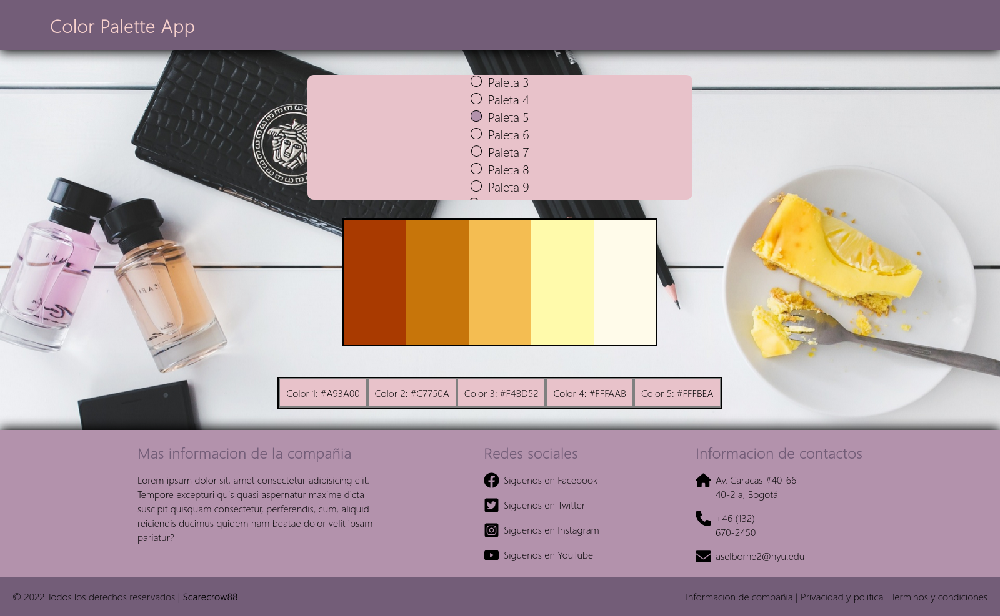
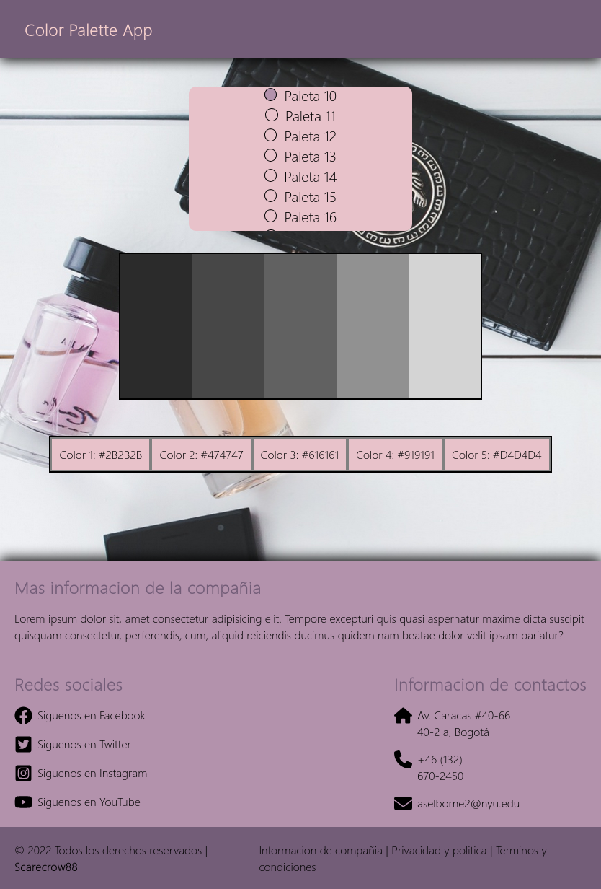
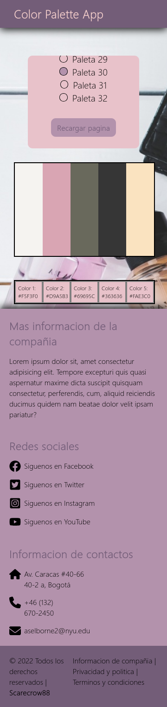

# Color Palette App
## Funcionalidades
- Cargar múltiples paletas de colores predefinidas
- Seleccionar paletas mediante botones de radio
- Visualizar 5 colores por paleta en cuadrados
- Mostrar códigos HEX de cada color
- Recargar la página para generar nuevas combinaciones

## Tecnologías utilizadas
- **Frontend:** React.js, JavaScript, HTML, CSS
- **Almacenamiento de datos:** JSON (colors.json)

## Arquitectura
- Monolítica
> Vista 1 de la página  
  
> Vista 2 de la página  
  
> Vista 3 de la página  
  

# **Nota:** Antes de salir, pasate a ver las branches